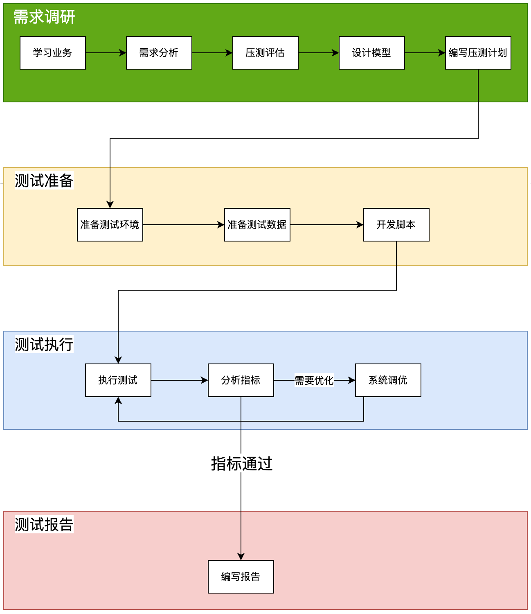

### 1、性能测试的流程

### 2、性能测试关注哪些指标？  
性能指标由 **压测结果指标** 和 **服务器指标** 两部分说明。
（1）**压测结果指标**
主要是根据JMeter生成的压测报告而言，则需要关注：==**吞吐量、请求的响应时间以及请求的错误率**==。
- ==**吞吐量：每秒钟系统能够处理的请求数**==。在系统压测过程中，会达到系统的一个最高值，此时如果继续加压，对应系统的吞吐量不会增高反而会下降。因为，虽然并发数在增加，但是系统已经超负荷工作，无法满足新的并发需求。
- ==**请求的响应时间：服务处理一个请求并获取它响应的时间**==。获取请求的响应时间，应从请求的平均值、90%请求、99%请求等多个角度统计，而不仅仅是根据平均值来进行判断。
- ==**请求的错误率：压测并发脚本中出错的请求所占比例**==。请求对错误率需要看具体是外部原因还是服务本身原因导致。外部原因比如网络超时等；服务本身由于逻辑或多线程处理问题导致。
（2）**服务器指标**
	服务器指标主要指的是服务器相关指标，比如：CPU、内存、网络、服务器负载等等。
在进行性能测试时，不能只关注一方面的指标，需要**压测结果指标** 和 **服务器指标**两方面结合来判断出系统的问题所在，给出最终压测结果报告。
### 3、JMeter中什么是组件？什么是元件？
在JMeter中，组件和元件是构成测试计划的基础元素，它们在执行性能测试时扮演着不同的角色。以下是对JMeter中组件和元件的简单说明：
#### 组件（Component）
**定义**：  
组件是JMeter中的一个高级概念，它通常指的是一组具有特定功能或目的的元件的集合。这些元件在测试计划中协同工作，以完成更复杂的测试任务或逻辑。组件为测试工程师提供了一种组织和控制测试计划执行流程的手段。
**特点**：
- **集合性**：组件包含多个相关的元件，这些元件共同实现特定的功能。
- **控制性**：某些组件（如逻辑控制器）能够控制其包含元件的执行顺序和逻辑，从而影响测试计划的执行流程。
- **可重用性**：组件可以被复用在不同的测试计划中，提高测试脚本的可维护性和可扩展性。
#### 元件（Element）
**定义**：  
元件是JMeter测试计划中的基本构建块，每个元件都承担着特定的测试任务。元件可以是简单的，如发送HTTP请求的取样器；也可以是复杂的，如包含多个其他元件的逻辑控制器。
**类型**：  
JMeter中的元件类型多样，包括但不限于以下几种：
- **取样器（Sampler）**：用于向服务器发送请求并记录响应信息，是性能测试中最基本的元件。
- **逻辑控制器（Logic Controller）**：用于控制测试计划中其他元件的执行顺序和逻辑，如循环控制器、事务控制器等。
- **配置元件（Config Element）**：维护取样器需要的配置信息，如HTTP请求默认值、Cookie管理器等。
- **断言（Assertions）**：用于验证服务器响应是否符合预期，如响应断言、XML断言等。
- **监听器（Listener）**：负责收集测试结果，并以可视化方式展示，如查看结果树、汇总报告等。
- **前置处理器（Pre-Processor）和后置处理器（Post-Processor）**：分别用于在请求发送之前和之后对请求或响应进行处理。

**特点**：
- **独立性**：每个元件都可以独立存在并发挥作用，但它们通常被组织在组件或测试计划中以实现更复杂的测试场景。
- **功能性**：每个元件都承担着特定的测试任务，如发送请求、验证响应、收集测试结果等。
- **灵活性**：元件之间可以通过配置和逻辑关系进行灵活组合，以满足不同的测试需求。
#### 总结
在JMeter中，组件和元件是构成测试计划的基础元素。组件是元件的集合，通过组织和控制元件的执行来实现特定的测试功能；而元件则是测试计划中的基本构建块，每个元件都承担着特定的测试任务。测试开发工程师需要熟悉JMeter中的组件和元件类型及其特点，以便高效地构建和维护测试计划。
### 4、JMeter 聚合报告包括哪些内容
聚合报告是在做性能压测经常会使用的一个监听器，对应该监听器中每个参数需要了解它具体代表的指标含义：
**Label**：显示的是JMeter中压测脚本中请求的名称
**样本**：代表的是请求数。具体数字标明这一次压测脚本运行时一共发出的请求个数。比如，模拟10个用户，每个用户对应并发10次，则样本数为100
**平均值**：平均响应时间。默认情况下是单个 Request 的平均响应时间
**中位数**：就是 50％ 并发的用户响应时间
**90% 百分位**：90％ 用户的响应时间
**最小值**：最小响应时间
**最大值**：最大响应时间
**异常%**：也就是请求的错误率。计算公式为：错误请求数/请求总数
**吞吐量**：默认情况下表示每秒完成的请求数
**接收KB/Sec**：每秒从服务器端接收到的数据量
以上就是对应聚合报告中参数指标以及含义。
**一般，在性能测试中需要重点关注的参数：样本请求数，平均响应时间，最小值，最大值，异常及吞吐量**。
### 5、一个JMeter压测脚本必须有的组件有哪些？
在JMeter压测脚本中，为了构建一个完整且有效的性能测试计划，通常需要包含以下几个核心组件。这些组件共同协作，以确保测试能够模拟真实用户行为并收集到有价值的性能数据。以下是一个JMeter压测脚本中通常必须有的组件：
1. **测试计划（Test Plan）**
    - 测试计划是整个测试脚本的容器，所有其他组件都必须添加到测试计划下。它定义了测试的基本信息和全局设置。
2. **线程组（Thread Group）**
    - 线程组是JMeter测试计划的开始点，用于设置模拟用户（线程）的数量、线程启动的时间间隔、循环次数等。它是控制并发用户数和执行测试迭代次数的关键组件。
3. **取样器（Sampler）**
    - 取样器是向服务器发送请求并接收响应的组件，它是性能测试中的核心。HTTP请求取样器是最常用的取样器之一，用于模拟HTTP请求。
4. **监听器（Listener）**
    - 监听器用于收集测试结果并展示给用户。常用的监听器包括查看结果树（View Results Tree）、聚合报告（Aggregate Report）等。监听器帮助测试人员分析测试数据，评估系统性能。
5. **配置元件（Config Element）**
    - 配置元件用于设置取样器所需的配置信息，如HTTP请求默认值（HTTP Request Defaults）、HTTP信息头管理器（HTTP Header Manager）等。这些配置信息对于确保请求的正确性和一致性至关重要。
6. **断言（Assertions）**
    - 断言用于验证服务器响应是否符合预期。通过断言，测试人员可以确保系统行为符合预期，从而增加测试的有效性和准确性。常用的断言包括响应断言（Response Assertion）等。
7. **控制器（Controller）**
    - 控制器用于控制测试计划中取样器和其他组件的执行顺序和逻辑。虽然并非所有测试脚本都必须包含控制器，但在复杂的测试场景中，控制器对于组织测试流程和控制测试执行非常有用。例如，循环控制器（Loop Controller）可以重复执行其下的取样器或控制器，事务控制器（Transaction Controller）可以将多个取样器组合成一个事务进行处理。

需要注意的是，虽然上述组件是构建JMeter压测脚本时常用的组件，但并非每个脚本都必须包含所有组件。实际测试中，应根据测试需求和目标灵活选择和配置组件。
此外，随着JMeter版本的不断更新和功能的不断完善，可能会有新的组件被引入或现有组件的功能得到扩展。因此，在构建JMeter压测脚本时，建议参考最新的JMeter官方文档或权威教程以获取最新信息。
### 6、JMeter中什么是BeanShell脚本？BeanShell怎样在请求前处理sampler请求的参数并增加参数值

### 7、jmeter什么是采样器（samplers）和线程组（thread group）？
- 线程组：对于任何测试计划，线程组元件都是 JMeter 的开始部分。这是 JMeter 的重要原件，你可以再其中设置多个用户和时间来加载线程组中给出的所有用户。
- 采样器：采样器生成一个或多个采样结果，这些采样结果具有许多属性，例如经过时间、数据大小等。采样器允许 JMeter 通过采样器将特定类型的请求发送到服务器，线程组决定需要发出的请求类型，一些有用的采样器包括 HTTP 请求，FTP 请求、JDBC 请求等

### 8、JMeter定时器的作用是什么
### 9、Jmeter工具如何做接口之间的关联
### 10、性能测试中，TPS比较低，可能是哪些方面的问题（Tps上不去什么原因，怎么排查，响应时间长如何分析）

### 11、性能测试中控制业务占比的组件是使用哪个
### 12、性能测试中怎么判断当前的网络不是压测的瓶颈
### 13、全链路压测如何做，分析性能瓶颈
### 14、内存泄漏、内存溢出的区别
### 15、性能测试接口响应慢应该如何分析？
### 16、如何去分析性能瓶颈问题，如何给出相关性能测试报告，报告需要有哪些内容才能具有说服力
### 17、压测工具的使用，性能三大指标
### 18、代码级监控及常用计数器及解析？
### 19、队列级监控及常用计数器及解析？
### 20、链路级监控及常用计数器及解析？例如 SkyWalking？