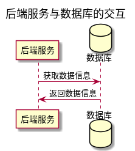

## 中间件篇
### 1、中间件Redis-你们公司有使用redis吗？知道它的作用是什么吗？应用场景了解吗？
**Redis 是一款开源的缓存数据库**
它具有以下特点：
- 读写性能优异（基于内存、IO 的多路复用+单进程）
- 数据类型丰富（k-v，list，set，zset，hash 等数据结构的存储）。
- Redis 支持数据的备份。
- 数据自动过期。
- 发布订阅。
- 分布式。

基于这样的特点，在查询数据的时候，使用与不使用Redis的流程也是完全不一样的。
首先我们先来看在不使用 Redis 进行查询操作的时候，后端的查询流程是：
1. 用户访问页面。
2. 请求后端服务。
3. 经过逻辑处理后，去数据库查询信息。

在添加 Redis 之后，后端的查询流程是：
1. 用户访问页面。
2. 请求后端服务。
3. 经过逻辑处理后，先去缓存（Redis）中进行查询，如果查到，则直接返回。
4. 如果没有查到信息，则直接向数据库进行查询，查询到之后，数据库会讲数据信息同步到缓存（Redis）中，以便下次查询。

**Redis 的应用场景**
从以上 Redis 的特点我们可以看出，它适宜的应用场景主要包含：
- 读多写少，并发强的场景，比如秒杀，明星热点。
- 有时间性的业务场景，比如短信验证码。
- 对有序集合数据类型排序，例如排行榜（有序集合数据类型）。
- 对于时效性要求不高，但是数据库请求较多的场景，比如计数器、社交网络。
- Session 会话缓存。
- 消息系统（较少，更多使用专业的消息队列中间件）。
- 单线程的特点可以天然用作分布式锁。（开发关注）
### 2、中间件Redis-Redis击穿、穿透区别，如何设计用例以及完成测试？

### 3、中间件Redis-怎么定位 Redis 缓存失效问题（缓存坏了）

### 4、中间件Redis-Redis你们的Redis使用的是淘汰缓存还是更新缓存，这两者有什么区别？请详细说明

### 5、中间件Redis-Redis缓存雪崩，击穿及穿透是什么以及对应的解决方案，怎么判断redis当前的碎片率及解决方法
### 6、中间件Redis-Redies缓存里数据跟数据库里数据不一致；这种情况是怎么发生的？业务方的规避手段和有效方式是什么？
缓存里数据跟数据库里数据不一致的情况**通常是因为缓存数据和数据库数据同步不及时，或者缓存数据过期导致的**。例如，在更新数据库数据时，没有及时更新缓存数据，或者缓存数据过期时间设置过短，导致缓存数据过期后仍然被访问，从而导致缓存数据和数据库数据不一致。
为了规避这种情况，业务方可以采取以下措施：
1. **合理设置缓存过期时间**：缓存过期时间应该根据业务需求和数据更新频率来设置，避免缓存数据过期时间过短或过长。
2. **及时更新缓存数据**：在数据库数据更新后，应该及时对缓存数据进行更新，避免缓存数据和数据库数据的不一致。
3. **采用缓存双写策略**：在数据写入数据库的同时，也将数据写入缓存，保证缓存数据和数据库数据的同步。
4. **采用缓存失效机制**：当数据库数据更新后，可以主动使缓存数据失效，从而保证下一次访问时能够重新从数据库中获取最新的数据。
在实际应用中，业务方可以结合以上规避手段，采用合适的方式来保证缓存数据和数据库数据的一致性。此外，也可以采用一些中间件或者技术，如 Redis 的发布/订阅模式、缓存预热、缓存穿透等技术，来进一步提高缓存数据的可靠性和有效性。
### 7、Redis缓存应用场景
Redis 是一款开源的缓存数据库，它具有以下特点：
- 读写性能优异（基于内存、IO 的多路复用+单进程）
- 数据类型丰富（k-v，list，set，zset，hash 等数据结构的存储）。
- Redis 支持数据的备份。
- 数据自动过期。
- 发布订阅。
- 分布式。

基于这样的特点，在查询数据的时候，使用与不使用Redis的流程也是完全不一样的。  
首先我们先来看在不使用 Redis 进行查询操作的时候，后端的查询流程是：
- 1、用户访问页面。
- 2、请求后端服务。
- 3、经过逻辑处理后，去数据库查询信息。

在添加 Redis 之后，后端的查询流程是：
- 1、用户访问页面。
- 2、请求后端服务。
- 3、经过逻辑处理后，先去缓存（Redis）中进行查询，如果查到，则直接返回。
- 4、如果没有查到信息，则直接向数据库进行查询，查询到之后，数据库会讲数据信息同步到缓存（Redis）中，以便下次查询。

Redis 的应用场景
从以上 Redis 的特点我们可以看出，它适宜的应用场景主要包含：
- 读多写少，并发强的场景，比如秒杀，明星热点。
- 有时间性的业务场景，比如短信验证码。
- 对有序集合数据类型排序，例如排行榜（有序集合数据类型）。
- 对于时效性要求不高，但是数据库请求较多的场景，比如计数器、社交网络。
- Session 会话缓存。
- 消息系统（较少，更多使用专业的消息队列中间件）。
- 单线程的特点可以天然用作分布式锁。（开发关注）